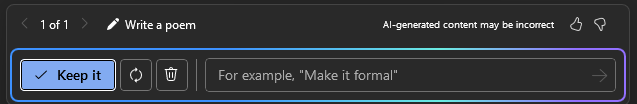

---
demo:
  title: '데모: Word의 Copilot'
---

[인덱스로 돌아가기](https://microsoftlearning.github.io/MS-4012-Microsoft-Copilot-Web-Based-Interactive-Experience-for-Executives/)

# Word의 Copilot

## 데모 설정

샘플 문서는 MS-4012 GitHub 리포지토리 [여기](https://github.com/MicrosoftLearning/MS-4012-Microsoft-Copilot-Unlocked/tree/master/Resourcefiles)에서 찾을 수 있습니다.

이 연습에서 사용되는 특정 파일은 다음과 같습니다.

- [**ContosoLearn 앱 개요.docx**](https://github.com/MicrosoftLearning/MS-4012-Microsoft-Copilot-Unlocked/raw/master/Resourcefiles/ContosoLearn%20App%20Overview.docx)
- [**ContosoLearn 경쟁 업체 SWOT.docx**](https://github.com/MicrosoftLearning/MS-4012-Microsoft-Copilot-Unlocked/raw/master/Resourcefiles/ContosoLearn%20Competitor%20SWOT.docx)
- [**ContosoLearn 가치 제안.docx**](https://github.com/MicrosoftLearning/MS-4012-Microsoft-Copilot-Unlocked/raw/master/Resourcefiles/ContosoLearn%20Value%20Proposition.docx)
- (선택 사항 - 아래 지침 참조) [**Microsoft FY24 2분기 실적 컨퍼런스콜**](https://github.com/MicrosoftLearning/MS-4012-Microsoft-Copilot-Unlocked/raw/master/Resourcefiles/Microsoft_FY24_Second_Quarter_Earnings_Conference_Call.docx) 

> **참고:**  이러한 파일을 OneDrive에 동기화하는 데 최대 10분이 걸릴 수 있습니다. 이 과정을 빠르게 진행하려면 문서를 열었다가 닫으면 MRU(최근에 사용한 목록)에 추가됩니다.

## 설명 점수

상호 작용 환경에서는 새로운 앱이나 서비스 아이디어를 브레인스토밍하고, 브랜드 아이덴티티와 마케팅 자산을 만들고, 경쟁 환경을 분석했습니다. 하지만 어떻게 하면 한 걸음 더 나아갈 수 있을까요?

Word의 Copilot을 사용하면 문서 작성 및 수정 프로세스를 혁신하여 매력적인 콘텐츠를 손쉽게 제작할 수 있습니다.

이 데모에서는 방금 만든 문서를 함께 변환하여 전략 분석 보고서를 만들어 보겠습니다. 또한 콘텐츠가 목표에 완벽하게 부합하도록 형식과 톤을 조정할 것입니다.

## 데모 단계

1. 바탕화면에서 또는 새 Edge 탭에서 **Word.new**를 입력하여 Microsoft Word를 시작합니다.
1. 문서 본문을 클릭하고 표시되는 **Copilot 아이콘**을 선택합니다.

    

1. 이제 Word에서 **Copilot을 사용한 초안** 창이 표시됩니다. 프롬프트 필드에 다음 프롬프트를 입력합니다.

    ```text
    Create a comprehensive strategic analysis report for ContosoLearn using the following files as references: /ContosoLearn App Overview, /ContosoLearn Competitor SWOT, and /ContosoLearn Value Proposition. The strategic analysis report should include the following sections:
        
    Executive Summary
    App Overview
    Market Research
    Competitor SWOT Analysis
    Value Proposition
    Conclusion
    ```

    > **중요:** 이 기능이 제대로 작동하려면 “/”를 다시 입력하고 MRU(최근에 사용한 목록)에서 올바른 파일을 선택해야 합니다.

1. 이제 Copilot이 사용자가 제공한 프롬프트에 따라 전략 분석 보고서의 초안을 생성합니다. Copilot가 완료되면 다음 프롬프트 창이 표시됩니다.

    
    
    프롬프트 필드에 다음을 입력합니다.

    ```text
    Remove the "Market Research" section and add a "Competitive Landscape" section. Ensure the content is concise and aligns with the overall tone of the document.
    ```

    > **참고:** Word용 Copilot이 협조하지 않는 경우 다음 링크를 사용하여 생성된 문서에 액세스할 수 있습니다: [**ContosoLearn 예제 워드 출력**](https://github.com/MicrosoftLearning/MS-4012-Microsoft-Copilot-Unlocked/raw/master/Allfiles/Demo%20Sample%20Docs/ContosoLearn_Example_Word_Output.docx).

## 선택적 데모 단계

### 대용량 문서 요약

1. 데스크톱의 Word에서 [**Microsoft FY24 Second Quarter Earnings Conference Call**](https://github.com/MicrosoftLearning/MS-4012-Microsoft-Copilot-Unlocked/raw/master/Resourcefiles/Microsoft_FY24_Second_Quarter_Earnings_Conference_Call.docx) 파일을 다운로드하여 엽니다.
1. Word의 리본에서 **Copilot 아이콘**을 선택합니다.

    

1. **이 문서에 대해 무엇이든 질문** 필드에 프롬프트를 복사하여 붙여 넣거나 다음을 입력합니다. 

    ```text
    Based on the document, how did AI impact Microsoft's earnings this year?
    ```

1. **보내기**를 선택합니다.  
1. **이 문서에 대해 무엇이든 질문** 필드에 프롬프트를 복사하여 붙여 넣거나 다음을 입력합니다. 

    ```text
    Copilot, generate a FAQ based on this document.
    ```
    
1. **보내기**를 선택합니다.

[인덱스로 돌아가기](https://microsoftlearning.github.io/MS-4012-Microsoft-Copilot-Web-Based-Interactive-Experience-for-Executives/)
