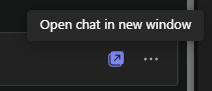

---
demo:
  title: '데모: Teams의 Copilot'
---

[인덱스로 돌아가기](https://microsoftlearning.github.io/MS-4012-Microsoft-Copilot-Web-Based-Interactive-Experience-for-Executives/)

# Teams의 Copilot

## 데모 설정

원활한 데모를 보장하려면 다음 설정 옵션 중 하나를 선택합니다.

**옵션 A: 모임 요약**

이 옵션에 대한 데모 설정 지침은 [여기](https://microsoft.seismic.com/Link/Content/DCFPQWmT2DMXC8WJjgjP4H44GWXG)에서 확인할 수 있습니다. 특히 아래 데모에서 참조할 Teams 모임(프로젝트 Avalon)을 설정하는 방법을 다룬 5~10페이지를 참조하세요.

> **중요:**
> - 옵션 A 데모 설정에는 4명 이상(선택 사항으로 6명)이 필요합니다.
> - 계획된 제공 전에 팀과 함께 이 작업을 수행합니다.
> - 완료되면 이 Teams 모임을 참조하여 향후 제공할 수 있습니다.
> - 어떤 이유로든 준비 작업을 수행할 수 없는 경우 옵션 B 데모를 참조하세요.

**옵션 B: Teams 채팅**

이 데모 옵션은 의도적으로 사전 설정이 필요하지 않습니다. 그러나 기존 Teams 채팅 스레드 중 하나를 활용해야 합니다. 데모에 사용하기 전에 이 채팅에서 공유된 기밀 정보가 없는지 확인.


## 옵션 A - 모임 요약 데모

### 설명 점수

“이제 Teams에서 모임 요약이라고 하는 것을 보여 드리겠습니다.

여기 저와 제 동료들의 모임이 있습니다. 기밀 유지를 위해 실제 회의는 보여드릴 수 없지만, 프로젝트 Avalon이라는 가상의 제품 출시에 대해 논의하는 가상의 회의를 팀원들과 함께 녹음한 영상을 보여드리겠습니다.

요약은 녹음된 대화 내용 기록을 기반으로 했습니다. 누가 언제 대화에 참여했는지 보여줍니다. 또한 우리가 말한 에 대한 요약도 있습니다. Copilot은 제가 원하는 내용을 더 쉽게 찾을 수 있도록 섹션별로  정리해 주었습니다.

이제 Copilot에게 질문하고 이 회의에 대한 자세한 정보를 얻을 수 있습니다. 예를 들어 논의된 내용과 각 사용자의 작업 항목을 살펴보겠습니다."

### 데모 단계

1. Microsoft Teams가 열려 있는 브라우저 탭으로 전환하여 모임 **프로젝트 Avalon 시작 모임**으로 이동합니다.

    > **중요:**  기밀 데이터가 포함된 모임이나 채팅은 표시하지 마세요.

1. **요약** 탭을 선택합니다.

    

1. **화자**를 가리킵니다.
1. **토픽**을 선택합니다.

    

1. **챕터**를 선택합니다.

    

1. 오른쪽 상단에서 **Copilot**을 선택합니다.

    

1. **이 미팅에 대해 무엇이든 질문** 텍스트 상자에 프롬프트를 복사하여 붙여 넣습니다.

    ```text
    Can you list action items and owners in a table?
    ```

1. **보내기**를 선택합니다.
1. **이 미팅에 대해 무엇이든 질문** 텍스트 상자에 프롬프트를 복사하여 붙여 넣습니다. 

    ```text
    Did anyone strongly oppose the decision, and how do you know?
    ```
    
1. **보내기**를 선택합니다.
1. **이 미팅에 대해 무엇이든 질문** 텍스트 상자에 프롬프트를 복사하여 붙여 넣습니다.

    ```text
    Based on the transcript, when would you recommend we launch the product and why?
    ```

1. **보내기**를 선택합니다.

## 옵션 B - Teams 채팅

### 설명 점수

“이제 Copilot을 통해 Teams 채팅 환경을 개선하는 방법을 보여드리겠습니다.

저와 제 동료 간의 채팅 스레드는 다음과 같습니다. Copilot은 채팅의 주요 내용을 요약하여 모든 메시지를 읽지 않고도 중요한 요점을 쉽게 파악할 수 있도록 도와줍니다.

이제 채팅에서 더 구체적인 정보를 얻기 위해 Copilot 질문을 할 수 있습니다. 예를 들어, 열려 있는 항목이 무엇이며 다음 단계를 어떻게 진행해야 하는지 알아봅시다.

또한 답장 초안을 작성하고 Copilot을 사용하여 메시지를 명확하고 간결하게 다듬을 수 있습니다. 이는 팀 내에서 효과적인 의사 소통을 보장하는 데 특히 유용합니다."

### 데모 단계

1. 기밀 정보를 공유하지 않은 Teams 채팅 스레드를 찾습니다. **새 창에서 채팅 열기** 옵션을 선택합니다.

    

1. Teams 채팅이 새 창에서 열리면 오른쪽 상단 모서리에서 **Copilot 열기**를 선택합니다.

    

1. Copilot 채팅 창이 열리면 **지난 날의 하이라이트***를 선택하여 지난 날의 채팅을 간략하게 요약합니다.

    

1. **이 채팅에 대해 질문하기** 텍스트 상자에 프롬프트를 복사하여 붙여 넣습니다. 

    ```text
    What are the open items?
    ```
    > **참고:** 대상 그룹을 더 잘 타겟팅할 수 있다고 생각되는 다른 프롬프트 예시를 자유롭게 선택하세요.   

1. 채팅 기록 아래의 **메시지 입력하기** 텍스트 상자에서  입력을 시작합니다. **아직 보내기를 누르지 마.**

1. 회신 초안을 작성한 상태에서 **메시지 입력하기** 텍스트 상자에서 Copilot을 선택합니다.

       

1. **다시 쓰기** 및 **조정** Copilots 옵션으로 Copilots 기능을 더 자세히 시연해 보세요.

         

[인덱스로 돌아가기](https://microsoftlearning.github.io/MS-4012-Microsoft-Copilot-Web-Based-Interactive-Experience-for-Executives/)
